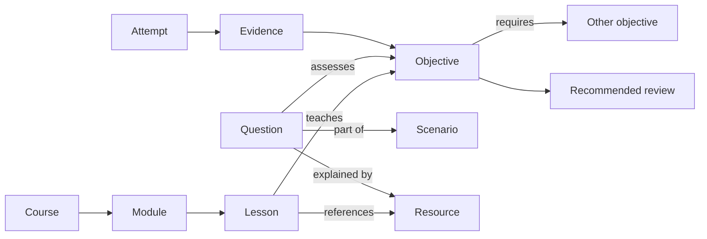

# Historical architecture proposal

This is the pre-implementation design, preserved for context. It includes future capabilities. The root README and architecture guide describe what is implemented.

# LearnForge — education framework proposal

Design proposal based on the local University/Orbit and AI-103/AB-100/Northstar solutions. Reviewed 25 September 2026. This document proposes implementation; it is not a running application.

Build a reusable learning platform around **versioned subject packs, a content templating engine, an objective map, and a common assessment engine**. Use Orbit as the main technical donor and Northstar as the exam-domain donor. Develop the shared platform in this workspace and migrate representative content into it before attempting a wholesale migration.

Working scope: personal study first, with authenticated ownership and a workspace boundary that can support classes later. The first audience remains an open product decision. A multi-organization launch would move tenant administration, instructor workflows, and isolation testing into the first milestone.

## 1. What to preserve and what to generalize

| Source | Preserve | Generalize |
|---|---|---|
| University / Orbit | Rich readings, focus mode, worked examples, misconceptions, prerequisite paths, numeric/order/code questions, review queues, applied activities, rubrics, reference bridges | Course terminology, content packaging, learner identity, question contracts, progress storage, subject-specific pages |
| AI-103 / Northstar | Objective citations, documentation navigation, specialty tracks, fresh-question rotation, immediate/delayed feedback, case sections | Exam identifiers, domain weights, timing, track configuration, browser persistence |
| AB-100 / Northstar | Business scenarios, constraint-based decisions, architecture explanations, objective coverage | Reusable scenario and rubric structures that also fit engineering, humanities, language learning, and other subjects |
| New mixed-format work in Northstar | Choice, select-N, matching, dropdown, ordering, per-part feedback and composition helpers | Versioned renderer/grader contracts, server-side validation, persistence and lifecycle tests |

The strongest shared educational pattern is: **learn a concept → see a worked example → attempt a task → understand the mistake → retry a different instance → demonstrate it independently**. Make that journey available to every subject.

The [source review](source-review.md) records evidence and verification limits. Both source repositories had uncommitted work; Northstar changed during inspection. Review a stable source revision before extracting code.

## 2. Stack and deployment shape

| Area | Proposed choice | Purpose |
|---|---|---|
| Backend | ASP.NET Core 10 + EF Core 10, latest supported patches | Main API, authorization, publishing, deterministic grading and attempt transactions |
| Frontend | Angular 22, current stable patch; standalone components, signals, lazy feature routes | Reusable learning, exam and authoring interfaces |
| Interaction primitives | Angular CDK plus a small design system | Drag/drop, overlays, focus behavior and consistent controls |
| Main database | PostgreSQL | Relational ownership, versions, attempts, graph edges, indexed reporting; JSONB for validated type-specific payloads |
| Files | Object storage with a local development adapter | Images, PDFs, audio, downloadable pack assets |
| Identity | ASP.NET Core Identity initially; OIDC integration when needed | Accounts now; institution sign-in later |
| Jobs | Durable database-backed jobs/outbox and a separate worker | Import, publication, indexing, exports, long-running grading |
| Diagnostics | Structured logs, OpenTelemetry traces/metrics, health/readiness checks | Explain slow requests, failed imports and grading backlogs |
| Validation | xUnit, PostgreSQL integration tests, Angular tests, Playwright | Verify domain rules, browser interactions and recovery |

As of this review, .NET 10 is the latest generally available LTS line and .NET 11 RC1 is available with go-live support. Choose .NET 10 for this baseline and evaluate 11 after general availability. Angular 22 is the active major; resolve and pin its current stable patch when scaffolding. Do not interpret a release schedule as proof that a particular minor has shipped. Sources: [.NET support](https://dotnet.microsoft.com/en-us/platform/support/policy/dotnet-core), [.NET downloads](https://dotnet.microsoft.com/en-us/download/dotnet), [Angular releases](https://angular.dev/reference/releases), [Angular compatibility](https://angular.dev/reference/versions).

Angular's zoneless operation is the default from v21 onward. Use signals for local UI state and RxJS for asynchronous request/stream coordination. Keep rendering components separate from attempt orchestration. Use typed reactive forms for authoring; select newer APIs only after checking their stability for the pinned release. Sources: [zoneless Angular](https://angular.dev/guide/zoneless), [CDK drag/drop](https://angular.dev/guide/drag-drop).

Start with a **modular monolith**: one API deployment, explicit feature boundaries, one database and independently runnable workers. This gives cross-module transactions without distributed-system overhead. Keep module contracts explicit so a genuinely hot or isolated workload can be extracted later. This choice is consistent with the architectural tradeoffs described in [Microsoft's architecture guidance](https://learn.microsoft.com/en-us/dotnet/architecture/modern-web-apps-azure/common-web-application-architectures).

Use Docker Compose locally. For a hosted deployment, run the Angular assets behind a web host/CDN, the API behind the same origin, and workers separately. Select the cloud from actual hosting preferences and cost constraints. Add a shared cache or broker when measured workloads justify it. Keep code-execution workers outside the API's trust boundary.

## 3. A reusable education model

Use a normal curriculum hierarchy for navigation:

```text
Program / learning path (optional)
  Course
    Module / unit
      Lesson
        Content blocks
```

Treat subject, certification and discipline as catalog metadata. A course can be a university course or a certification preparation course. Orbit currently calls a unit a `Course`; translate that in the importer rather than carrying the naming ambiguity into the framework.

Alongside the hierarchy, maintain explicit relationships:



Separate a **concept** from a **measurable objective**. “Recursion” is a concept; “trace a recursive call and identify its base case” is an objective. Exam blueprint objectives have stable IDs plus the exact published wording and source edition. Text edits and translations must not become new identities accidentally.

Store graph edges in ordinary relational tables initially. Require the prerequisite subgraph to be acyclic; related-concept links may be cyclic. Explicit cross-course prerequisites can support mathematics → algorithms without forcing every subject to depend on another course.

The map should offer three views over the same data: a course outline, a prerequisite graph, and an objective coverage matrix. Each objective shows learning resources, practice items, difficulty coverage and learner evidence. Offer an accessible outline/table alongside the graph. This unifies Orbit's curriculum map and Northstar's documentation map without treating them as interchangeable.

Core records:

| Module | Main records |
|---|---|
| Catalog and curriculum | Course, Module, Lesson, CurriculumPlacement, Concept, Objective, PrerequisiteEdge |
| Content | ContentItem, ContentRevision, ContentBlock, Asset, SourceReference, PackRelease |
| Assessment bank | Question, QuestionRevision, QuestionObjective, ScenarioRevision, RubricRevision |
| Exam delivery | BlueprintRevision, Attempt, AttemptSection, AttemptItem, ResponseRevision, GradeRevision |
| Learning | Enrollment, CompletionRecord, EvidenceRecord, ObjectiveProgress, ReviewSchedule, LearnerNote |
| Administration | User, Workspace, Membership, PublicationReview, AuditRecord, ImportJob |

Use relational columns for identity, ownership, filtering and joins. Use JSONB for bounded, schema-validated block and interaction payloads. PostgreSQL supports JSONB indexing, but it does not replace application schema validation or relational constraints. Source: [PostgreSQL JSON types](https://www.postgresql.org/docs/current/datatype-json.html).

## 4. Subject packs: the unit of reuse

A new subject should be importable without editing application code. A pack contains:

```text
packs/example-course/
  manifest.json
  curriculum.json
  objectives.json
  lessons/
  questions/
  scenarios/
  blueprints/
  resources/
  assets/
```

The manifest declares a stable pack ID, release version, schema version, language, prerequisites/dependencies, required interaction kinds, licensing metadata and asset checksums. Pack versions and schema versions are separate: content changes need not imply a format change.

Author readings as Markdown plus structured blocks. Blocks include text, math, figures, video/audio with transcripts, glossary, worked example, misconception, retrieval check, code sample and interactive activity. Preserve Orbit's standard/focus reading variants. A typed block registry allows a new teaching interaction without changing the lesson shell.

Use one canonical content source per revision. A Git-authored import and a web-editor draft both create drafts through the same validation pipeline; they never overwrite a published revision. Publishing emits immutable delivery data, a search index and any allowed offline bundle from the same revision.

Published attempts and enrollments pin pack/question/blueprint revisions. Corrections create new revisions. An explicit grade correction records who changed what and why, preserving the original result. Pack updates must not silently revoke completed lessons or alter a past exam's answers.

A pack is **data**. New executable renderers or graders require a reviewed extension package with explicit compatibility. Avoid arbitrary code inside imported content. Maintain separate server-only grading artifacts and learner delivery artifacts; an authoring export containing keys is never an offline learner download.

### LearnForge Content Engine

The content engine is LearnForge's authoring compiler. It turns concise, reusable templates into validated subject-pack releases and generated delivery artifacts. Authors work with stable IDs and meaningful fields instead of repeating lesson, objective and question boilerplate by hand.

Its pipeline is:

```text
Template source → expansion → schema validation → cross-validation → release artifacts
```

The source remains reviewable in Git. Expansion produces a normalized intermediate representation (IR); validation runs against the IR; generated delivery JSON, private grading data, Angular fallback data, search documents, offline bundles and QTI exports are release outputs. Generated files are never hand-edited.

Use YAML or JSON for structured templates and Markdown with front matter for lesson prose. The template language should support variables, defaults, declared loops, conditionals, partials and structured includes. Keep it deliberately small: content builds must not execute arbitrary JavaScript or C# and must not make network calls.

Example:

```yaml
template: question.choice-multiple.v1
id: ai103.search.security-01
objective: ai103.search.access-control
prompt: "Select two controls that keep the index private."
options:
  - { id: private-endpoint, text: "Use a private endpoint" }
  - { id: public-key, text: "Place a key in the browser" }
  - { id: managed-identity, text: "Use managed identity" }
  - { id: disable-auth, text: "Disable authentication" }
  - { id: public-network, text: "Enable public network access" }
correct: [private-endpoint, managed-identity]
```

Reusable partials should cover patterns such as `lesson.standard-reading`, `lesson.focus-summary`, `question.choice-multiple`, `question.dropdown`, `question.sequence`, `scenario.case-study`, `rubric.design-review` and `reference.source`. A pack can customize wording and presentation while retaining the same contract. Every expanded node records its source template, input hash, engine version and generated IDs.

Validation has three layers:

| Layer | Checks |
|---|---|
| Template/schema | Required fields, valid block and interaction type, source locations, unique IDs and answer shape |
| Pack integrity | Resolved references, objective membership, acyclic prerequisites, asset existence, licensing and accessibility metadata |
| Cross-validation | Lesson objectives have practice, questions map to objectives, blueprints are satisfiable, translations preserve IDs, public artifacts contain no keys, and Angular/server grading fixtures agree |

Cross-validation must compare the C# and TypeScript grading fixtures for multi-select, ordering, numeric tolerance, dropdown blanks and partial credit. The same fixture should produce the same earned points, possible points and result state in both implementations.

The CLI should make authoring and review fast:

```text
learnforge init pack my-course
learnforge new lesson --from lesson.standard-reading
learnforge new question --type choice-multiple
learnforge check packs/my-course
learnforge check --watch packs/my-course
learnforge preview packs/my-course --open
learnforge build packs/my-course --target delivery,offline,qti
learnforge diff packs/my-course --against main
learnforge publish packs/my-course --version 1.2.0
```

`check --watch` should debounce changes, validate affected templates first, then validate dependent nodes. Cache parsed templates, expanded IR and asset hashes. CI and publishing always perform a clean full check. Reports should include human-readable diagnostics plus JSON and SARIF output for editors and code-host annotations.

Keep generic checks in the engine and pack-specific rules in declarative profiles. An AI-103 profile can require Microsoft Learn citations; a mathematics profile can require proof metadata; a language profile can require transcripts and pronunciation audio. Profiles may add checks but cannot weaken core schema, security, answer-key separation or accessibility rules.

The web authoring UI should use the same engine through a validation service. Draft editors receive field-level diagnostics, preview expanded content and compare the generated IR with the previous revision. The server re-expands and validates the original draft before accepting a release; it never trusts a browser-generated delivery document. See the detailed [content-engine design](content-engine.md).

## 5. One question engine with explicit contracts

Separate four responsibilities: the prompt and interaction definition, the learner response, the private scoring definition, and the feedback policy. The same question can be used in a lesson, drill, mock exam or scheduled assessment.

| Interaction | Response | Authoring and grading rules |
|---|---|---|
| Single choice | One option ID | Exactly one selected option; known ID; one defensible key |
| Select N from M | Set of option IDs | Explicit min/max selections; exact-set or declared partial-credit policy |
| Drag-and-drop matching | Target IDs mapped to token IDs | Target capacities; reuse policy; distractors; complete/partial response states |
| Dropdown blanks | Blank IDs mapped to option IDs | Independent or shared banks; every blank referenced exactly once |
| Sequence / ordering | Ordered token IDs | Exact permutation initially; alternative valid sequences or precedence rules as an extension |
| Numeric | Value, optionally unit | Decimal precision, absolute/relative tolerance, unit conversion rules |
| Short answer | Text or structured response | Normalization and accepted variants explicitly declared |
| Written response / proof | Draft and attachments | Rubric and human assessment or visibly labeled self-review |
| Code / SQL | Source plus execution configuration ID | Isolated runner, private fixtures, resource limits and explicit result status |

Ship the first five required interactions together in the initial assessment engine. Numeric is a small, valuable extension because Orbit already uses it. Keep open response and code on separate grading paths so a pending human review or infrastructure failure is never treated as a wrong answer.

Use stable option, blank, target and token IDs, never displayed labels or array positions as persistent identities. Persist the actual randomized presentation and its seed. This makes shuffling, localization and response replay safe.

Each interaction registration supplies a schema, authoring controls, learner renderer, response validator, grader and review renderer. Use TypeScript discriminated unions and C# typed records/handlers. Generate API contracts from OpenAPI and run shared grading fixtures across implementations; avoid a giant model with dozens of optional answer fields.

Example delivery contract for the user's “select two out of five” requirement:

```json
{
  "questionRevisionId": "q-example:r1",
  "kind": "choice.multiple",
  "schemaVersion": 1,
  "prompt": "Select the two statements that satisfy the stated condition.",
  "interaction": {
    "minSelections": 2,
    "maxSelections": 2,
    "options": [
      { "id": "a", "text": "Statement A" },
      { "id": "b", "text": "Statement B" },
      { "id": "c", "text": "Statement C" },
      { "id": "d", "text": "Statement D" },
      { "id": "e", "text": "Statement E" }
    ]
  }
}
```

The private definition identifies the keys and policy. A draft may be incomplete; a finalized response is either valid under its selection contract or recorded as unanswered/incomplete according to exam policy. Reject unknown IDs, duplicates and over-selection on the server, even if the client prevents them.

Make scoring a declared policy. Orbit's multi-select currently uses exact-set grading; Northstar's new helpers support per-part points. Both are legitimate platform options, but neither should silently become the universal rule. By default, normalize each question's earned fraction to its declared weight: `earnedFraction × itemWeight`. Raw per-part weighting is an explicit alternative. A six-blank item should not accidentally count six times more than a single-choice item.

Store earned points, maximum points, full correctness, assistance, skipped state and feedback separately. Blueprint domain weights must specify whether they refer to question counts or score weights. Practice thresholds are product settings; they do not predict an external provider's scaled exam score.

Drag/drop and ordering must support click-to-select/click-to-place and keyboard controls, visible focus, screen-reader announcements and undo/clear. Pointer dragging alone is insufficient; keyboard access alone also does not satisfy the separate non-dragging pointer requirement. Source: [WCAG dragging guidance](https://www.w3.org/WAI/WCAG22/Understanding/dragging-movements).

## 6. Exam modes are policies, not separate applications

| Preset | Selection and feedback | Typical purpose |
|---|---|---|
| Learn | Topic selection, immediate explanations, hints and retries | Understand a new concept |
| Quick drill | Short targeted session, immediate or end feedback | Fit practice into limited time |
| Diagnostic | Broad objective coverage, end feedback | Identify gaps before studying |
| Mock exam | Weighted blueprint, time limit, delayed explanations | Rehearse exam conditions |
| Case-study exam | Intact scenarios, configurable section locking | Apply knowledge under shared constraints |
| Weak objectives | Prioritize weak and insufficiently evidenced objectives | Choose useful next practice |
| Mistake review | Previous errors plus fresh related variants | Repair misconceptions |
| Spaced review | Due items mixed across objectives | Retain learning |
| Mastery check | Fresh items, declared assistance and pass rules | Demonstrate independent performance |
| Instructor assessment | Scheduled access, accommodations and release policy | Classroom use in a later milestone |

Represent a preset as a versioned blueprint plus policies for scope, count, domain/format/difficulty distribution, feedback timing, navigation, section locking, duration, breaks, hints, retakes, scoring, result release and offline eligibility. Full/short are size presets. Real/review are feedback presets. Keep them composable where pedagogically valid.

Compose scenarios as atomic sections. Account for their objectives and points before selecting standalone items. Exclude duplicate and mutually revealing items, favor unseen question families, then least-recently-seen items. Track reservation, presentation and answer reveal separately so an abandoned attempt has a sensible rotation policy.

Validate that a blueprint can be satisfied before starting. A strict mock fails with an actionable shortage report. A relaxed drill may shorten or widen its scope, but the learner sees that change. Never silently claim a requested distribution after filling shortages from arbitrary domains. Persist the chosen items and composition diagnostics so an exam remains reproducible.

Begin adaptive practice with transparent heuristics: objective coverage, incorrect answers, assistance, recency and variety. Add psychometric adaptive testing only after sufficient calibrated item data exists.

## 7. Durable attempts and trustworthy results

An attempt pins its blueprint revision, question/scenario revisions, presentation order, grading version, accommodations and server deadline. Its lifecycle is explicit: created → in progress → submitted → grading → completed; cancellation and expiry have explicit policy outcomes. Expiry can automatically submit saved answers. Section locks are server transitions.

Autosave each changed response with an expected revision and idempotency key. A successful response means the database committed it. The UI shows saving/saved/retry states and retains an IndexedDB recovery copy. On conflicts, retrieve the latest server version and resolve visibly; do not silently overwrite another tab's response.

Use server time for deadlines and derive the displayed countdown from that deadline. Check expiry on every write/submit plus a durable background sweep. Browser throttling, refresh, disconnects and a late worker must not extend an assessment. Duplicate submit calls return the same result, and expired writes are handled by the pinned policy.

The server performs deterministic scoring. Learner DTOs exclude keys, hidden fixtures and explanations until policy permits disclosure. Assessment-only items remain outside public learning packs and asset bundles. Once a solution has been disclosed, record exposure; it cannot later count as unseen evidence.

Use authenticated `/me` ownership rather than an arbitrary learner ID supplied by the browser. With same-origin cookie sessions, protect state-changing requests against CSRF. Enforce resource authorization for attempts, drafts, assets and authoring endpoints. Identity supplies account functions; choose institution federation separately when needed. Source: [ASP.NET Core Identity](https://learn.microsoft.com/en-us/aspnet/core/security/authentication/identity?view=aspnetcore-10.0).

Offline learning can download explicitly eligible lessons and practice items. Its local grading is practice evidence with disclosed/offline provenance. Formal timed attempts require server enforcement; a client-controlled device clock is not authoritative. Sync immutable learning events and idempotent responses; never merge scores by taking whichever value is larger.

### Security considerations

Treat LearnForge as a system holding personal learning records and, for some packs, commercially sensitive assessment content. Use threat modeling during each major feature rather than adding security only at deployment time.

| Area | Required controls |
|---|---|
| Identity and sessions | ASP.NET Core Identity with secure password hashing, email/account recovery controls, MFA-ready flows, short-lived access tokens or secure same-site cookies, refresh-token rotation, session revocation and device/session visibility |
| Authorization | Enforce workspace, enrollment, role and resource ownership on every API request; use policy-based authorization for learner, instructor, reviewer and publisher actions; never trust a learner, workspace or attempt ID supplied by the browser |
| Assessment secrecy | Keep answer keys, private rubrics, hidden fixtures, unreleased explanations and assessment-only items in server-only projections; prevent them from Angular bundles, offline packs, logs, URLs and error messages |
| Attempt integrity | Server-issued deadlines, immutable revision pins, idempotency keys, optimistic concurrency, section-lock transitions and append-only response history; reject expired or cross-user writes |
| Web/API protection | HTTPS, strict security headers and CSP, CSRF protection for cookie-authenticated writes, origin checks, input/output encoding, request size limits, rate limits and uniform error responses |
| Content and authoring | Treat imported templates and Markdown as untrusted; sanitize HTML and SVG; allowlisted asset types; dependency-pack permission checks; signed release manifests; review and publish separation |
| Code execution | Run code in a separate hardened worker with no network, read-only filesystem, non-root identity, CPU/memory/process/time limits, ephemeral storage and a narrow job protocol. The API must not expose Docker or host control sockets |
| Data protection | Encrypt transport and database/object-storage backups, minimize collected profile data, separate analytics identifiers from account identity where possible, define retention/export/deletion policies and audit administrator access |
| Operations | Secret manager, key rotation, dependency/image scanning, database migration review, structured audit events, anomaly alerts, restore drills and a documented incident-response path |

Do not put answer keys in source maps or rely on the Angular client to hide them. Do not log raw responses, source code, access tokens or private content by default. Redact personal data in telemetry and make audit records tamper-evident. For institutional use, add tenant isolation tests, SSO/OIDC validation, roster synchronization controls and a formal data-processing review before enabling organization-wide access.

Use a security boundary around the content engine as well: template includes are pack-scoped, generators are deterministic and sandboxed, asset paths cannot escape the pack, and a malicious or malformed pack cannot execute during validation. CI should run dependency, secret, container and license checks alongside content checks.

## 7.1 Learner dashboard, history and readiness

The learner dashboard is the home screen after sign-in. It should answer four questions immediately: what should I study next, how am I performing, what have I attempted, and whether my recent evidence supports considering the real exam.

Show:

- active courses and next recommended lesson or objective;
- progress by course, module and objective, with sample counts and an explicit “insufficient evidence” state;
- recent attempts with mode, exam/track, score, time used, completion state and revision;
- attempts-in-progress with resume, expiry and synchronization status;
- accuracy trends for short drills, full mocks and case studies;
- strongest and weakest objectives, recent mistakes and recommended fresh practice;
- a readiness card with the evidence behind every recommendation;
- export, privacy and account/session controls.

Keep attempt history filterable by pack, exam, mode, date range, objective, score and completion state. The attempt detail page shows the blueprint composition, per-domain and per-objective results, question-level review allowed by the release policy, time usage, hints/assistance, exposed items, mistakes and the next practice recommendation. Results from an old question revision remain labeled with that revision.

Use explicit records rather than recomputing history from current content:

```text
AttemptSummary
  id, userId, packReleaseId, blueprintReleaseId, mode, track
  startedAt, submittedAt, duration, status
  earnedPoints, possiblePoints, accuracy
  fullyCorrectItems, itemCount, assistedItems, exposedItems

AttemptObjectiveResult
  attemptId, objectiveId, earnedPoints, possiblePoints
  fullyCorrectItems, itemCount, assistanceCount, questionRevisionIds

ReadinessEvaluation
  userId, packReleaseId, evaluatedAt, policyVersion
  qualifyingShortAttempts, qualifyingFullAttempts
  accuracy, coverage, freshness, assistanceFree
  status, reasons, recommendedNextStep
```

### Readiness recommendation policy

The default policy should be configurable per exam blueprint. A first implementation can use the rule the user described:

| Evidence | Default threshold |
|---|---|
| Short mocks | The latest **5 completed short mocks** have accuracy above **90%** |
| Full mocks | The latest **3 completed full mocks** have accuracy above **90%** |

Accuracy should be `earned points / possible points`, so mixed-format items are handled consistently. Each qualifying attempt must also be completed in the configured time, use no hints or solution reveals, contain no unresolved grading/technical failure, and include the blueprint's minimum objective/domain coverage. The default lookback is 90 days, and a repeated identical item or exposed solution cannot count as fresh evidence. These are policy defaults, not hard-coded product assumptions.

The dashboard should say **“Your recent practice supports considering the real exam”**, not “you will pass.” It should show the exact qualifying attempts, score calculation, coverage gaps, stale-evidence warning and the next weakest objectives. If neither rule is met, show the nearest actionable state, such as “4 of 5 qualifying short mocks” or “full-mock accuracy is 87%; practise these three objectives.”

Additional safeguards improve the signal without hiding the simple rule:

- require at least one qualifying full mock before displaying a strong recommendation, unless the blueprint explicitly allows short-only readiness;
- cap the contribution of repeated question families and prefer unseen variants;
- report accuracy and fully-correct rate separately when partial credit exists;
- exclude attempts completed with disclosed answers from independent-readiness evidence while retaining them in learning history;
- downgrade the recommendation when objective coverage or recent evidence is insufficient;
- recalculate when a question or grading revision is invalidated, preserving the previous evaluation for audit.

Readiness is a learning aid, not a promise about a vendor's scaled score. It must never automatically purchase an exam, submit an application or schedule a real test. It can offer a user-controlled link to the relevant exam information.

Dashboard API endpoints should include `GET /api/me/dashboard`, `GET /api/me/attempts`, `GET /api/me/attempts/{id}`, `GET /api/me/analysis`, `GET /api/me/readiness/{packSlug}`, and explicit export/delete endpoints. All responses are scoped to the authenticated user and workspace. Cache aggregate analysis briefly, but invalidate it when an attempt completes, evidence is exposed or a pack/grading revision is superseded.

## 8. Progress, authoring and platform quality

Keep four distinct signals: content completion, objective evidence, exam performance and applied work. A learner can read every lesson while still needing practice. Repeatedly answering the same exposed item should not appear equivalent to solving fresh variants independently.

Store evidence with objective, question family/revision, result, assistance, assessment mode and time. Display sample counts and “insufficient evidence” where appropriate. Start with explainable objective summaries, not a fabricated probability of passing. Self-reviewed essays and instructor-graded essays remain distinguishable.

Authoring is a first-class feature: import preview, lesson/block editor, interaction-specific item editor, scenario builder, objective linking, blueprint preview, learner preview, draft review, publish/rollback and learner issue reports. Begin with file imports and a minimal editor, then expand author workflows.

Publishing validates schemas, IDs, references, keys, accessible alternatives, prerequisites, citations, asset rights metadata and blueprint feasibility. Keep subject-specific checks configurable: Northstar's Microsoft terminology/citation rules are useful for its pack, not for every discipline. Length-balance and explanation heuristics help reviewers; they do not establish factual correctness.

Source references carry author/title, URL or locator, attribution/license information, retrieved/reviewed dates and applicable product or syllabus edition. A changed documentation page creates a review task; it never silently rewrites a question or a completed score.

Potential later differentiators: a misconception notebook linked to fresh retry variants, compare-two-solutions activities, confidence before feedback, an explain-it-back exercise, exam lookup practice, cross-course prerequisite recommendations and connected projects. Prioritize activities that produce useful learning evidence over decorative rewards.

AI can later draft questions and explanations, propose objective tags, identify likely duplicates, and tutor from approved course material with citations. Generated content enters draft review. Authoring retrieval can access keys; learner tutoring must honor assessment release policies. Objective scoring remains deterministic; essay feedback is advisory until a validated and reviewable grading workflow exists.

For interoperability, plan a supported subset of QTI import/export with explicit loss reports, then LTI 1.3/Advantage when integrating with an institution's LMS. QTI exchanges questions/tests/results; LTI connects tools, launch contexts and grade services. Neither requires using their wire format as the internal domain model. Sources: [QTI specifications](https://www.1edtech.org/standards/qti/index), [LTI Advantage](https://standards.1edtech.org/lti/specifications/guides/conformance/conformance-guide).

## 9. Suggested repository and API boundaries

```text
apps/
  api/                       ASP.NET composition root
  web/                       Angular application
  worker/                    Durable jobs and grading coordination
modules/
  Curriculum/
  Content/
  Assessments/
  Learning/
  Identity/
  Authoring/
packages/
  angular-content/           Content block registry/renderers
  angular-assessment/        Question inputs/review renderers
  api-client/                Generated client contracts
  content-schema/            Versioned schemas and fixtures
  content-engine/            Template expansion, IR and cross-validation
tools/
  import-orbit/
  import-northstar/
  learnforge-cli/            check, preview, build, diff and publish commands
packs/
tests/
```

Keep C# use cases organized by feature within each module. Modules own their database tables and expose explicit contracts. Use a small shared foundation for IDs, time and result types. Avoid creating public NuGet/npm packages until the boundaries survive multiple real subject migrations.

Initial API surface: catalog/course releases, lesson delivery, objective map, `/api/me/dashboard`, `/api/me/progress`, `/api/me/attempts`, `/api/me/analysis`, `/api/me/readiness/{packSlug}`, attempt creation, attempt resume, response save, section submit, final submit, result review, history export/delete, and authoring draft/publish endpoints. Keep authoring and learner DTOs separate. Generate the TypeScript client from the actual API specification.

## 10. Delivery milestones and acceptance criteria

| Milestone | Deliverable | Exit criterion |
|---|---|---|
| 1. Contracts and foundations | Solution, identity/ownership, PostgreSQL, content schemas, content-engine IR, import preview, CI | Import one Orbit unit and small AI-103/AB-100 slices with stable ID mappings |
| 2. Complete learning/assessment slice | Reader, objective links, five required question types, learn/mock policies, autosave, review | Learn → practice → submit → explanation → objective evidence works in all three slices |
| 3. Reuse and authoring | Pack publisher, template partials, CLI checks/preview, basic editors, map, references, generic routing | A fourth unrelated subject is added through templates and data alone |
| 4. Exam depth | Scenarios, locks, weighted composition, dashboard analysis, readiness recommendations, diagnosis, mistakes and spaced review | Reproducible exams; shortage reporting; fresh/assisted evidence distinguished; readiness reasons are inspectable |
| 5. Migration and resilience | Validated importers, offline study, history import, backup/restore, performance work | Agreed source parity and recovery tests pass on a pinned migration snapshot |
| 6. Broader platform | Classes, instructor rubrics, organizational administration, interoperability, optional AI | Added according to actual audience demand and validated workflows |

Use a deliberately small but varied first slice: one Discrete Mathematics unit for rich teaching and numeric/ordering behavior, one AI-103 objective group for mixed-format technical assessment, and one AB-100 case for shared-scenario judgment. Then add a small nontechnical pack to expose hidden STEM/vendor assumptions.

Import canonical sources rather than generated frontend fallbacks. Preserve source namespaces and an old-ID → new-ID/revision mapping. Import device-local history only through an explicit learner export/import, labeled as legacy evidence; do not infer it from repository files. Preserve source score units and assistance meaning instead of recomputing old outcomes under new policies.

University's Data Engineering content is frozen by its current project instructions. Leave it unchanged and outside the active migration/content-edit scope until that scope is explicitly reopened.

Before hosted use, test server-enforced deadlines/locks, refresh/resume, simultaneous tabs, duplicate requests, response/submit races, question edits during attempts, private-key absence, cross-user access, import rollback, and background-job recovery. Use shared grading fixtures for partial credit, invalid selections, repeated tokens, blank ordering and numeric tolerances. Exercise all five required interactions by mouse, keyboard and touch alternatives.

Proposed initial load target, to be confirmed against expected usage: 1,000 active attempts with a five-second autosave cadence (about 200 writes/second), including synchronized submission bursts. Measure response-save p95 below 500 ms and exam-start p95 below two seconds on an agreed deployment. These are acceptance targets, not current capacity claims. Load-test transaction contention, connection pools and worker backlog, and verify backup restoration before promising service levels.

The first architectural proof is simple: **the same application runs a university unit, an implementation certification track, an architecture case study and an unrelated subject without subject-specific application code.**
